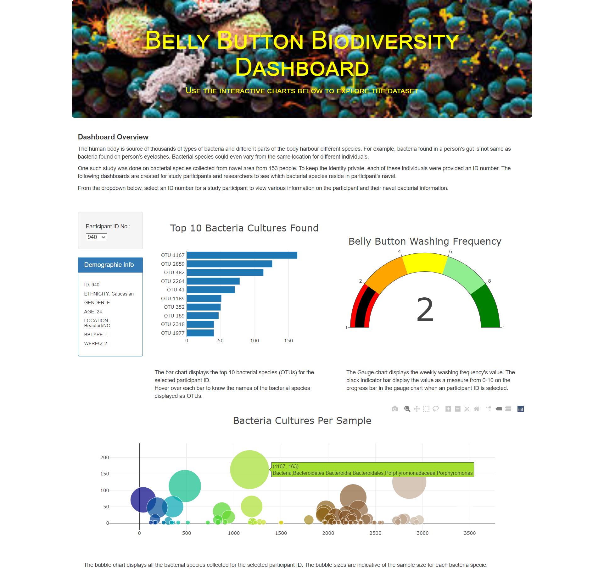

# Bellybutton Biodiversity Dashboard

The human body is source of thousands of types of bacteria and different parts of the body harbour different species.

For example, bacteria found in a person's gut is not same as bacteria found on person's eyelashes. Bacterial species could even vary from the same location for different individuals. 

One such study was done on bacterial species collected from navel area from 153 people. To keep the identity private, each of these individuals were provided an ID number. The data from that study is available in [samples.json](samples.json).

Using Javascript Plotly library and D3, interactive dashboards are created. The data in the dashboards change dynamically for the selected participant ID from the dropdown.

The dashboard page is made available using Github pages. 
Access the page here: [https://vnitusingh.github.io/plotly_deploy/](https://vnitusingh.github.io/plotly_deploy/)

Here is how the page looks:

When the page is first loaded, the dashboard displays data for first participant in the list with ID 940.

Let's look at the dashboard for a sample user. 

Data snippet for participant ID: 940

    {
    "names":["940,..."],
    "metadata":[{"id": 940, "ethnicity": "Caucasian", "gender": "F", "age": 24.0, "location": "Beaufort/NC", "bbtype": "I", "wfreq": 2.0},...],
    "samples":[{"id": "940", 
                "otu_ids": [1167, 2859,... ], 
                "sample_values": [163, 126, ...], 
                "otu_labels": ["Bacteria;Bacteroidetes;Bacteroidia;Bacteroidales;Porphyromonadaceae;Porphyromonas", "Bacteria;Firmicutes;Clostridia;Clostridiales;IncertaeSedisXI;...]
             },...],        
    } 

There are 4 areas that display participant information. 

1. ***Demographic Information:*** Displays demographic information of the participant like age, ethnicity, location etc.
    > * Used value from 'metadata' list to obtain demographic information.

2. ***Bar Chart - Top 10 Bacteria Cultures Found:*** The bar chart displays the top 10 bacterial species (OTUs) for the selected participant ID.
Hover over each bar to know the names of the bacterial species displayed as OTUs.
    > * Used the first 10 items from 'sample_values' list within 'samples' list to display x_axis values.
    > * Used the first 10 items from 'otu_ids' list within 'samples' list to display y_axis values.
    > * Used the first 10 items from 'otu_labels' list within 'samples' list to display hover texts.
    

3. ***Gauge Chart - Belly Button Washing Frequency:*** The Gauge chart displays the weekly washing frequency's value. The black indicator bar display the value as a measure from 0-10 on the progress bar in the gauge chart for the selected participant ID.
    > * Used 'wfreq' value from 'metadata' list to set value for the gauge chart.
    > * Gauge type is set as "indicator" and mode is set as "gauge+number".

4. ***Bubble Chart - Bacteria Cultures Per Sample:*** The bubble chart displays all the bacterial species collected for the selected participant ID. The bubble sizes are indicative of the sample size for each bacteria specie.
    > * Used 'otu_ids' list within 'samples' list to display x_axis values.
    > * Used 'sample_values' list within 'samples' list to display y_axis values.
    > * Used 'otu_labels' list within 'samples' list to display hover texts.
    > * Used 'sample_values' list within 'samples' list to set marker size.
    > * Used 'otu_ids' list within 'samples' list to set marker colors.

